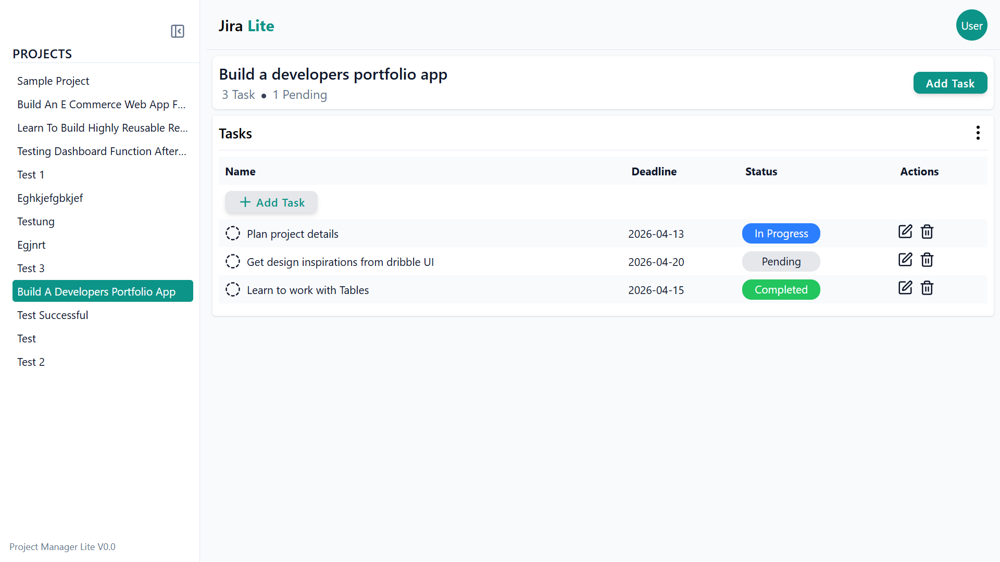

# 🚀 Client Project Management App: Jira Lite

An authenticated project management dashboard using **React, Tailwind, Firebase Auth, and Firestore** with **nested collections, protected routes, and dynamic CRUD operations.**

A streamlined, high-performance **Project Management Tool** built for modern teams. This isn't just another to-do list; it’s a full-stack dashboard designed with a focus on **visual hierarchy, scalable architecture, and fluid UX.**

---

## 🛠️ The Tech Stack

| **Layer**    | **Technology**     | **Purpose**                             |
| ------------ | ------------------ | --------------------------------------- |
| **Frontend** | React 18           | Declarative UI & Component Architecture |
| **Styling**  | Tailwind CSS       | Utility-first, responsive design system |
| **Database** | Firebase Firestore | Real-time NoSQL data synchronization    |
| **Auth**     | Firebase Auth      | Secure, persistent user sessions        |
| **Routing**  | React Router 6     | Nested layouts and dynamic sub-routes   |
| **Icons**    | Lucide React       | Clean, consistent visual language       |

---

## ✨ Key Features

- **Auth-Protected Workspaces:** Secure user login with persistent sessions via `AuthContext`.
- **Dynamic Project Routing:** Seamlessly switch between projects using nested React Router layouts.
- **Comprehensive Task CRUD:** Create, read, update, and delete tasks with instant UI updates.
- **Hybrid Navigation:** A sophisticated "responsive-toggle" sidebar that behaves as a persistent pillar on desktop and a slide-over drawer on mobile.
- **Visual Status Tracking:** Color-coded status badges (**Pending**, **In Progress**, **Completed**) for immediate progress assessment.
- **Centralized Modal System:** Clean, modal-based workflows for adding and editing tasks without leaving the dashboard context.

---

## 🏗️ Architecture & Best Practices

One of the primary goals of this project was to move beyond "component-heavy" logic and implement a professional **Service-Oriented Architecture.**

- **Service Layer:** All Firebase Firestore logic is decoupled from components and centralized in `src/services/`. This makes the code testable and keeps UI components lean.
- **Custom Context Providers:** User state is managed via a global `AuthContext`, preventing prop-drilling and ensuring data is available where it’s needed.
- **Responsive UI Logic:** Implemented a polymorphic sidebar system using Tailwind breakpoints (`md:`) and `pointer-events` to ensure zero "dead zones" on mobile devices.
- **UX-First Design:** Prioritized user experience by implementing consistent spacing systems, logical input hierarchies, and optimized re-render cycles.

---

## 📸 Preview

> 

---

## 🚀 Getting Started

1. **Clone the repository**

   `git clone https://github.com/pradeep-jais/Jira-Lite`

2. **Install dependencies**

   `npm install`

3. **Setup Firebase**
   - Create a `.env` file in the root directory.
   - Add your Firebase configuration keys (API Key, Auth Domain, Project ID, etc.).
4. **Run the development server**

   `npm run dev`

---

## 📈 Roadmap

- [ ] **Real-time Collaboration:** Implement Firestore snapshots for live team updates.
- [ ] **Drag-and-Drop:** Integrate `dnd-kit` for Kanban-style task management.
- [ ] **Dark Mode:** Add a system-aware dark theme using Tailwind’s `dark:` classes.
- [ ] **Advanced Filtering:** Filter tasks by deadline or priority level.

---

### 👨‍💻 Developed by Pradeep Kumar(Github: pradeep-jais)

Building products that bridge the gap between **clean code** and **intuitive design**.
